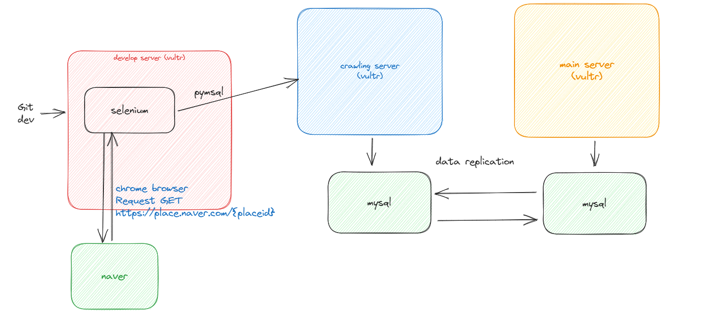

# crawling-meme
use python

1. python 3.8 & 3.9
2. pip ([get-pip.py](https://bootstrap.pypa.io/get-pip.py))
3. chrome
4. webdriver-manager
5. selenium

```shell
# mac, linux
apt update
apt install python3-
apt-get install python3-pip

# linux
python3 -m venv .venv/{project-name} # 프로젝트별 모듈 지정
.venv/{project-name}/bin/pip install selenium # 해당 프로젝트의 pip 모듈 설치

source .venv/bin/activate # (.venv) 진입
python3 -m pip install selenium
pip install webdriver-manager

# mac
pip install selenium
pip install --upgrade pip

# 크롬 설치
wget https://dl.google.com/linux/direct/google-chrome-stable_current_amd64.deb
sudo apt install ./google-chrome-stable_current_amd64.deb

# windows pycharm
# pycharm 내에서 별도 selenium, web_driver 패키지 설치
```

## 크롬 드라이버 설치

- 사용한 버전

```text
ChromeDriver 114.0.5735.90
```

## pymysql 설치

```text
pip install pymysql
```

## 실행방법
```shell
python3 main.py -blog # RDBMS에 등록된 네이버 플레이스 전체 크롤링
```


### UML 다이어그램


### 시퀀스 다이어그램


### 아키텍처

