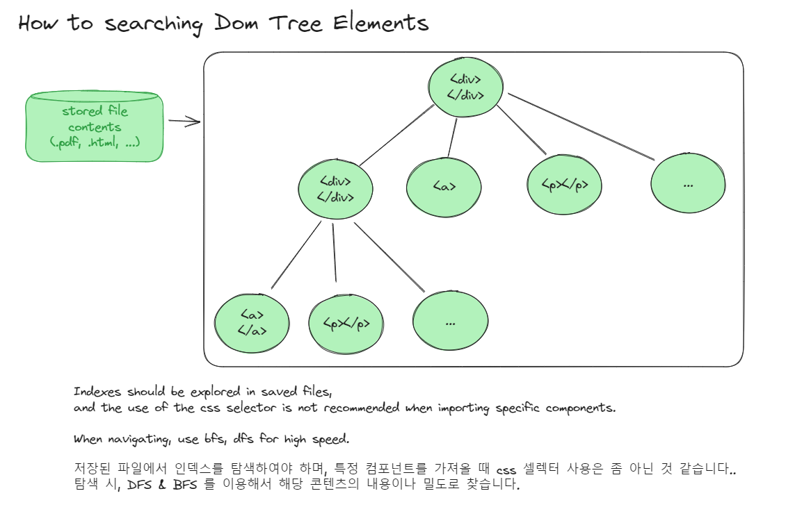

# crawling-meme
use python

1. python 3.8 & 3.9
2. pip ([get-pip.py](https://bootstrap.pypa.io/get-pip.py))
3. chrome
4. webdriver-manager
5. selenium

```shell
# mac, linux
apt update
apt install python3-
apt-get install python3-pip

# linux
python3 -m venv .venv/{project-name} # 프로젝트별 모듈 지정
.venv/{project-name}/bin/pip install selenium # 해당 프로젝트의 pip 모듈 설치

source .venv/bin/activate # (.venv) 진입
python3 -m pip install selenium
pip install webdriver-manager

# mac
pip install selenium
pip install --upgrade pip

# 크롬 설치
wget https://dl.google.com/linux/direct/google-chrome-stable_current_amd64.deb
sudo apt install ./google-chrome-stable_current_amd64.deb

# windows pycharm
# pycharm 내에서 별도 selenium, web_driver 패키지 설치
```

## 크롬 드라이버 설치

- 사용한 버전

```text
ChromeDriver 114.0.5735.90
```

## pymysql 설치

```text
pip install pymysql
```

## 실행방법
```shell
python3 main.py -blog # RDBMS에 등록된 네이버 플레이스 전체 크롤링
```


### UML 다이어그램


### 시퀀스 다이어그램


### 현재의 아키텍처


-----

### 웹 크롤러에 대해서

- 웹 크롤러는 조직적, 자동화된 방법으로 월드 와이드 웹을 탐색하는 컴퓨터 프로그램이다
- 시드 url에서 재귀적으로 하위 url을 탐색 진행한다


- 내가 작성했던 것에서는 네트워크를 이용해서 브라우저를 열어서 해당 url을 탐색해서 css 요소를 탐색하는 것을 찾는다 ㅠㅠ..
  - 해당 url을 별도 스토리지에 파일로 저장해둔 뒤에 파일을 가져오는 방식으로 진행하면 어떨까?
  - 해당 url 경로가 변경되었는지 아닌지 판별하는 것?
  - 해당 url 경로가 내가 원하는 것인지 아닌지 판별하는 것?
  - 해당 url까지 탐색하는 과정에서 별도 인증이 필요할 경우엔 어떻게 자동으로 진행할 것?
- 위 내용은 상당히 어려운 내용이지만 연구대상 인 것 같다.

### 탐색하는 과정을 좀 더 효율적으로..


